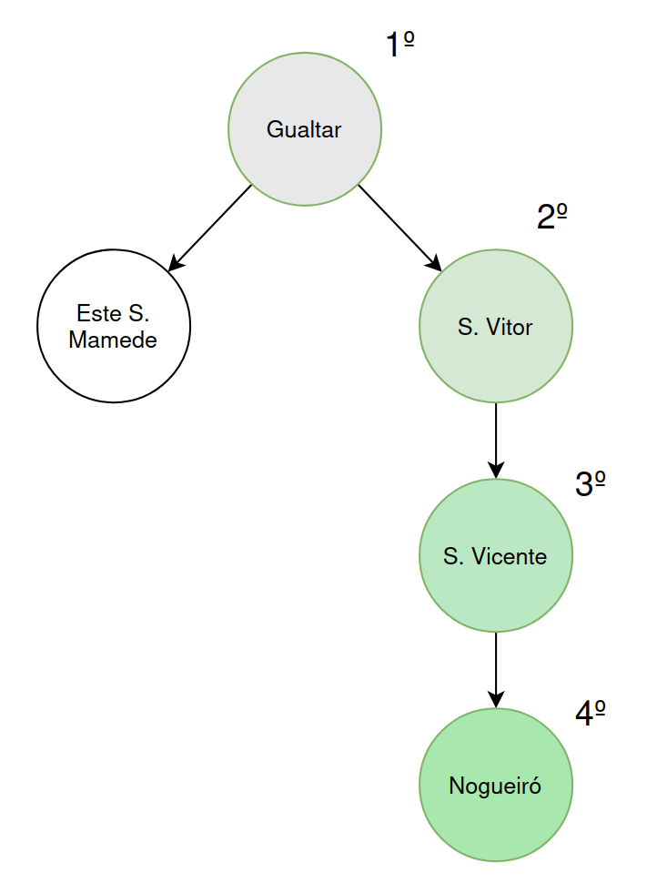
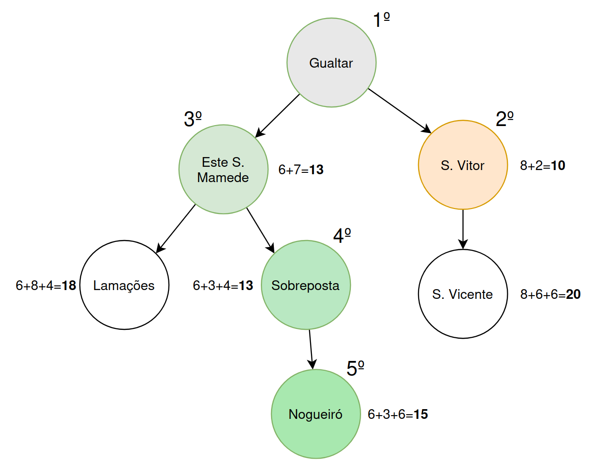

# IA - Ficha Teórico-Prática 02

Resolução da Ficha Teórico-Prática 02 de Inteligência Artificial 2025/2026.

## Pesquisa Gulosa

A pesquisa gulosa guia-se apenas pelo valor da heuristica, logo a solução será: `Gualtar`, `S.Vitor`, `S.Vicente`, `Nogueiró`.

O custo será: 22

## Pesquisa A\*

A pesquisa A\* guia-se pelo valor da heuristica e pelo custo do caminho até ao nodo atual, logo a solução será: `Gualtar`, `Este S.Mamede`, `Sobreposta`, `Nogueiró`.

O custo será: 15

**Nota**: este algoritmo começa por expandir para o a cidade **S.Vitor**, mas como **S.Vicente** tem um maior custo que **Este S.Mamede**, este algotitmo opta por **S.Mamede**.

## Cenário de congestionamento de tráfego

Seria necessário alterar a função de heurística.
