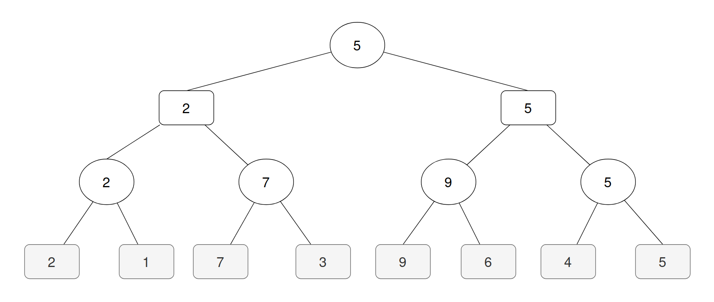
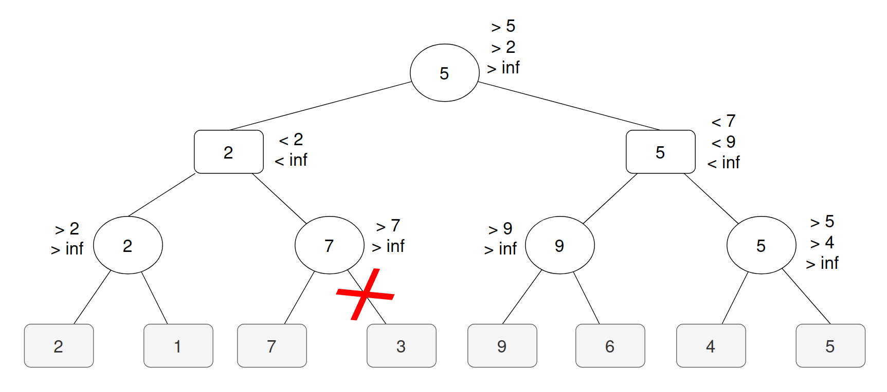
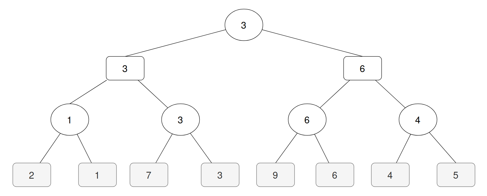

# Teste Modelo 2025

Teste Modelo de **Inteligência Artificial** 2024/2025.

## Grupo 01

### Questão 01

Formulação do problema:
- **Estado inicial**: `[A,A,A,C,C,C,_]`
- **Condição objetivo**: todos os `C`'s à esquerda de todos os `A`'s
- **Operadores de mudança de estado**:
    - mover uma peça para uma posição adjacente vazia
    - mover uma peça por cima de uma outra peça adjacente, para uma posição vazia
    - mover uma peça por cima de duas peças adjacentes, para uma posição vazia
- **Estados finais**:
    - `[C,C,C,A,A,A,_]`
    - `[C,C,C,A,A,_,A]`
    - `[C,C,C,A,_,A,A]`
    - `[C,C,C,_,A,A,A]`
    - `[C,C,_,C,A,A,A]`
    - `[C,_,C,C,A,A,A]`
    - `[_,C,C,C,A,A,A]`

### Questão 02

Estes algoritmos usasam-se em contextos em que o espaço de busca é muito grande, situações em que não é necessário determinar a solução ótima global, mas uma solução ótima local basta e quando o tempo é limitado, ou o número de iterações.

Estes cenários podem ser um máximo/minimo local, isto é, o algoritmo encontrou o melhor estado dos seus vizinhos, mas não é a melhor solução. Isto acontece quando o algoritmo não encontra um vizinho com um estado melhor, logo este assume que encontrou a solução. Existe também a situação de planaltos, isto é, são regiões do espaço que tẽm todas o mesmo valor, logo o algoritmo não consegue progredir.

Formas de solucionar este problema:
- perturbações aleatórias: executar o algoritmo várias vezes a partir de pontos iniciais aleatórios
- permitir executar movimentos que pioram a solução, de forma a escapar ótimos locais (**Simulated Annealing**)
- manter um registo de estados visitados para evitar ciclos (**Tabu Search**)
- utilizar algoritmos baseados em população (**Genetic Algorithms**, **Ant Colony**, **Particle Swarm**)

## Grupo 02

### Questão 01

### Questão 02

### Questão 03

## Grupo 03

### Questão 01

**Verdadeiro**, Prolog é um sistema de inferência e baseia-se apenas na base de conhecimento, tudo o que está fora desta é falso.

### Questão 02

**Falso**, O algoritmo de procura "Gulosa" escolhe o próximo nodo baseando-se exclusivamente na menor heuristica, o algoritmo A* escolhe o próximo nodo baseando-se na menor heurística e no custo do caminho até ao nodo atual. Ambos são algoritmos de procura informada.

### Questão 03

**Verdadeiro**, o predicado calcula sucessivamente o quadrado da cabeça da lista até encontrar uma lista vazia (`[]`).

### Questão 04

**Falso**, A poda alfa-beta permite que o algoritmo Minimax ignore partes do espaço de busca que não afetarão o resultado final, aumentando a eficiência evitando desperdicio de computações desnecessárias.

